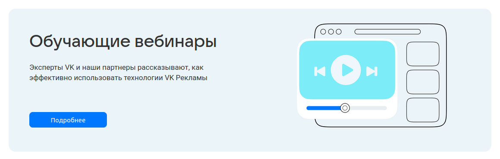
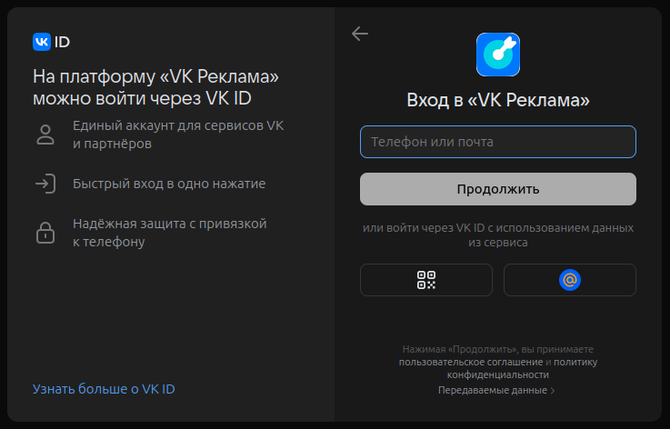

# Домашнее задание 3 по курсу QA

## Разделы:
1. [Главная страница](#главная-страница)
2. [Хедер](#хедер)
3. [Футер](#футер)
4. [Авторизация](#авторизация)
5. [Регистрация кабинета](#регистрация-кабинета)


## Главная страница

> https://ads.vk.com/  
> Без авторизации

### Карусель


- Главная страница. Карусель. Происходит автоматическая смена слайдов
- Главная страница. Карусель. При нажатии на элемент управления слайдами происходит смена текущего слайда
- Главная страница. Карусель. При нажатии на кнопку "Получить бонус" открывается страница https://ads.vk.com/promo/firstbonus
- Главная страница. Карусель. При нажатии на кнопку "Зарегистрироваться" открывается страница с выбором способа авторизации

### Кейсы компаний


- Главная страница. Кейсы компаний. При нажатии на ссылку "Смотреть все" открывается страница https://ads.vk.com/cases
- Главная страница. Кейсы компаний. При нажатии на блок кейса открывается страница этого кейса

### Вебинары



- Главная страница. Вебинары. При нажатии на блок "Обучающие вебинары" открывается страница https://ads.vk.com/events
- Главная страница. Вебинары. При нажатии на кнопку "Подробнее" открывается страница https://ads.vk.com/events

## Хедер

> https://ads.vk.com/  
> Без авторизации


- Хедер. При нажатии на логотип "VK Реклама" открывается страница https://ads.vk.com
- Хедер. При нажатии на кнопку "Новости" открывается страница https://ads.vk.com/news
- Хедер. При наведении на элемент "Обучение" появляется выпадающий список
- Хедер. При нажатии на кнопку "Кейсы" открывается страница https://ads.vk.com/cases
- Хедер. При нажатии на кнопку "Форум идей" открывается страница https://ads.vk.com/upvote
- Хедер. При нажатии на кнопку "Монетизация" в новой вкладке открывается страница https://ads.vk.com/partner
- Хедер. При нажатии на кнопку "Справка" открывается страница https://ads.vk.com/help
- Хедер. При нажатии на кнопку "Перейти в кабинет" открывается страница с выбором способа авторизации

### Выпадающий список "Обучение"


- Хедер. Выпадающий список "Обучение". При нажатии на кнопку "Полезные материалы" открывается страница https://ads.vk.com/insights
- Хедер. Выпадающий список "Обучение". При нажатии на кнопку "Мероприятия" открывается страница https://ads.vk.com/events
- Хедер. Выпадающий список "Обучение". При нажатии на кнопку "Видеокурсы" в новой вкладке открывается страница https://expert.vk.com/catalog/courses/
- Хедер. Выпадающий список "Обучение". При нажатии на кнопку "Сертификация" в новой вкладке открывается страница https://expert.vk.com/certification/


## Футер

> https://ads.vk.com/  
> Без авторизации


- Футер. При нажатии на кнопку "Перейти в кабинет" открывается страница с выбором способа авторизации

### Разделы

- Футер. Разделы. При нажатии на кнопку "Новости" открывается страница https://ads.vk.com/news
- Футер. Разделы. При нажатии на кнопку "Полезные материалы" открывается страница https://ads.vk.com/insights
- Футер. Разделы. При нажатии на кнопку "Мероприятия" открывается страница https://ads.vk.com/events
- Футер. Разделы. При нажатии на кнопку "Документы" открывается страница https://ads.vk.com/documents
- Футер. Разделы. При нажатии на кнопку "Обучение для бизнеса" в новой вкладке открывается страница https://expert.vk.com/
- Футер. Разделы. При нажатии на кнопку "Кейсы" открывается страница https://ads.vk.com/cases
- Футер. Разделы. При нажатии на кнопку "Помощь" открывается страница https://ads.vk.com/help
- Футер. Разделы. При нажатии на кнопку "Монетизация" в новой вкладке открывается страница https://ads.vk.com/partner

### Нижняя панель

- Футер. Нижняя панель. При нажатии на логотип "VK бизнес" в новой вкладке открывается страница https://vk.company/ru/company/business/
- Футер. Нижняя панель. При нажатии на логотипы ВК, Одноклассники и Телеграм в новой вкладке открываются соответствующие сайты
- Футер. Нижняя панель. При нажатии на кнопку "О компании" в новой вкладке открывается страница https://vk.company/ru/
- Футер. Нижняя панель. При нажатии на иконку текущего языка появляется выпадающее меню


- Футер. Нижняя панель. Выпадающее меню. При нажатии на кнопку "English" открывается страница https://ads.vk.com/en

## Авторизация

> На странице https://ads.vk.com/ необходимо нажать на кнопку "Перейти в кабинет",
> после этого откроется страница с выбором способа авторизации


- Авторизация. При нажатии на кнопку "Войти в другой аккаунт" появляется поле для ввода логина



- Авторизация. Ошибка при вводе несуществующего логина


## Регистрация кабинета

> https://ads.vk.com/hq/registration  
> Нужна авторизация


- Регистрация кабинета. При нажатии на кнопку "Создать новый кабинет" открывается страница https://ads.vk.com/hq/registration/new


- Регистрация кабинета. При нажатии на кнопку English текст меняется на английский
- Регистрация кабинета. При выборе страны Россия в поле "Валюта" доступен "Российский рубль (RUB)"
- Регистрация кабинета. При выборе любой страны кроме России в выпадающем меню поля "Валюта" доступны "Доллар США (USD)" и "Евро (EUR)"
- Регистрация кабинета. Ошибка "Обязательное поле" при незаполненном поле Email
- Регистрация кабинета. Ошибка "Некорректный email адрес" при вводе email`а, не соответствующего формату ```имя почтового ящика + @ + почтовый домен```
- Регистрация кабинета. Ошибка при вводе ИНН меньше 12 символов
- Регистрация кабинета. Ошибка при вводе ИНН больше 12 символов
- Регистрация кабинета. Ошибка "Обязательное поле" при отсутствии галочки на чекбоксе "Создавая кабинет, вы принимаете условия"
- Регистрация кабинета. При выборе типа аккаунта "Агентство" исчезает кнопка "Физическое лицо"


- Регистрация кабинета. При выборе типа аккаунта "Юридическое лицо" скрываются поля ИНН и ФИО


- Регистрация кабинета. При корректном заполнении формы регистрации кабинета и нажатии на кнопку "Создать кабинет" регистрация успешно завершается и открывается страница https://ads.vk.com/hq/dashboard


## Аудитории

> https://ads.vk.com/hq/audience  
> Нужна авторизация и зарегистрированный кабинет