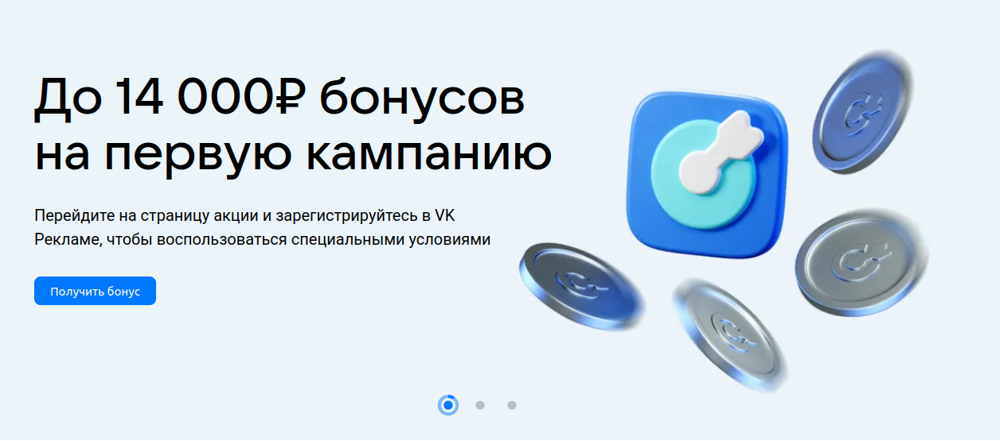
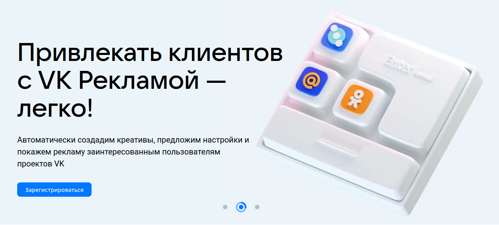
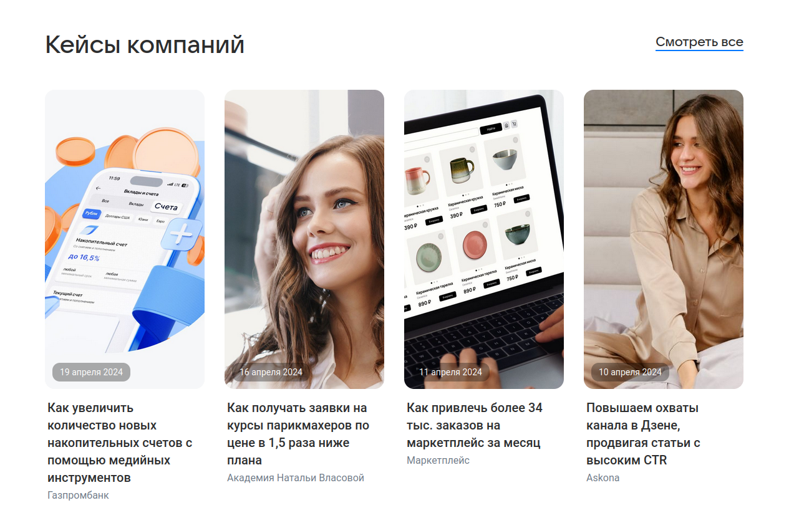

# Домашнее задание 3 по курсу QA

## Разделы:
1. [Главная страница](#главная-страница)

## Главная страница

- Карусель. Происходит автоматическая смена слайдов
- Карусель. При нажатии на элемент управления слайдами происходит смена текущего слайда
- Карусель. При нажатии на кнопку "Получить бонус" открывается [страница с акцией](https://ads.vk.com/promo/firstbonus)
- Карусель. При нажатии на кнопку "Зарегистрироваться" открывается страница регистрации

---

- Кейсы компаний. При нажатии на ссылку "Смотреть все" открывается [страница кейсов](https://ads.vk.com/cases)
- Кейсы компаний. При нажатии на блок кейса открывается страница этого кейса

---

- Вебинары. При нажатии на блок "Обучающие вебинары" открывается [страница мероприятий](https://ads.vk.com/events)
- Вебинары. При нажатии на кнопку "Подробнее" открывается [страница мероприятий](https://ads.vk.com/events)

