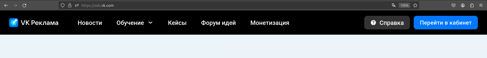
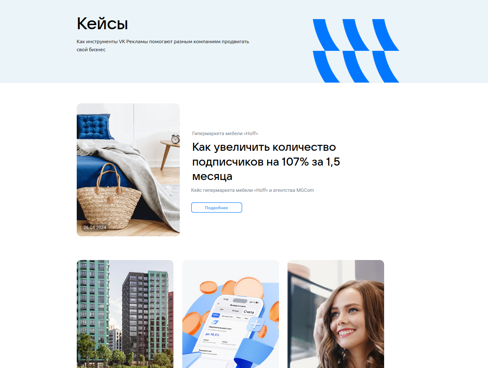

# Домашнее задание 3 по курсу QA

## Разделы:
1. [Хедер](#хедер)
2. [Футер](#футер)
3. [Главная страница](#главная-страница)
4. [Новости](#новости)
5. [Страница новости](#страница-новости)
6. [Кейсы](#кейсы)
7. [Страница кейса](#страница-кейса)
8. [Форум идей](#форум-идей)
9. [Монетизация](#монетизация)
10. [Авторизация](#авторизация)
11. [Регистрация кабинета](#регистрация-кабинета)


## Хедер

> https://ads.vk.com/  
> Без авторизации



- Хедер. При нажатии на логотип "VK Реклама" открывается страница https://ads.vk.com
- Хедер. При нажатии на кнопку "Новости" открывается страница https://ads.vk.com/news
- Хедер. При наведении на элемент "Обучение" появляется выпадающий список
- Хедер. При нажатии на кнопку "Кейсы" открывается страница https://ads.vk.com/cases
- Хедер. При нажатии на кнопку "Форум идей" открывается страница https://ads.vk.com/upvote
- Хедер. При нажатии на кнопку "Монетизация" в новой вкладке открывается страница https://ads.vk.com/partner
- Хедер. При нажатии на кнопку "Справка" открывается страница https://ads.vk.com/help
- Хедер. При нажатии на кнопку "Перейти в кабинет" открывается страница с выбором способа авторизации

### Выпадающий список "Обучение"


- Хедер. Выпадающий список "Обучение". При нажатии на кнопку "Полезные материалы" открывается страница https://ads.vk.com/insights
- Хедер. Выпадающий список "Обучение". При нажатии на кнопку "Мероприятия" открывается страница https://ads.vk.com/events
- Хедер. Выпадающий список "Обучение". При нажатии на кнопку "Видеокурсы" в новой вкладке открывается страница https://expert.vk.com/catalog/courses/
- Хедер. Выпадающий список "Обучение". При нажатии на кнопку "Сертификация" в новой вкладке открывается страница https://expert.vk.com/certification/


## Футер

> https://ads.vk.com/  
> Без авторизации


- Футер. При нажатии на кнопку "Перейти в кабинет" открывается страница с выбором способа авторизации

### Разделы

- Футер. Разделы. При нажатии на кнопку "Новости" открывается страница https://ads.vk.com/news
- Футер. Разделы. При нажатии на кнопку "Полезные материалы" открывается страница https://ads.vk.com/insights
- Футер. Разделы. При нажатии на кнопку "Мероприятия" открывается страница https://ads.vk.com/events
- Футер. Разделы. При нажатии на кнопку "Документы" открывается страница https://ads.vk.com/documents
- Футер. Разделы. При нажатии на кнопку "Обучение для бизнеса" в новой вкладке открывается страница https://expert.vk.com/
- Футер. Разделы. При нажатии на кнопку "Кейсы" открывается страница https://ads.vk.com/cases
- Футер. Разделы. При нажатии на кнопку "Помощь" открывается страница https://ads.vk.com/help
- Футер. Разделы. При нажатии на кнопку "Монетизация" в новой вкладке открывается страница https://ads.vk.com/partner

### Нижняя панель

- Футер. Нижняя панель. При нажатии на логотип "VK бизнес" в новой вкладке открывается страница https://vk.company/ru/company/business/
- Футер. Нижняя панель. При нажатии на логотипы ВК, Одноклассники и Телеграм в новой вкладке открываются соответствующие сайты
- Футер. Нижняя панель. При нажатии на кнопку "О компании" в новой вкладке открывается страница https://vk.company/ru/
- Футер. Нижняя панель. При нажатии на иконку текущего языка появляется выпадающее меню


- Футер. Нижняя панель. Выпадающее меню. При нажатии на кнопку "English" открывается страница https://ads.vk.com/en


## Главная страница

> https://ads.vk.com/  
> Без авторизации

### Карусель


- Главная страница. Карусель. Происходит автоматическая смена слайдов
- Главная страница. Карусель. При нажатии на элемент управления слайдами происходит смена текущего слайда
- Главная страница. Карусель. При нажатии на кнопку "Получить бонус" открывается страница https://ads.vk.com/promo/firstbonus
- Главная страница. Карусель. При нажатии на кнопку "Зарегистрироваться" открывается страница с выбором способа авторизации

### Кейсы компаний


- Главная страница. Кейсы компаний. При нажатии на ссылку "Смотреть все" открывается страница https://ads.vk.com/cases
- Главная страница. Кейсы компаний. При нажатии на блок кейса открывается [страница этого кейса](#страница-кейса)

### Вебинары


- Главная страница. Вебинары. При нажатии на блок "Обучающие вебинары" открывается страница https://ads.vk.com/events
- Главная страница. Вебинары. При нажатии на кнопку "Подробнее" открывается страница https://ads.vk.com/events


## Новости

> https://ads.vk.com/news  
> Без авторизации


- Новости. При нажатии на кнопку "Подробнее" открывается страница новости


- Новости. При нажатии на блок новости открывается страница этой новости

## Страница новости

> https://ads.vk.com/news/{str:title}  
> Без авторизации


- Страница новости. При нажатии стрелку "Новости" открывается страница https://ads.vk.com/news
- Страница новости. При нажатии на кнопку с текстом "В кабинет" или "Запустить рекламу" внизу страницы
в новой вкладке открывается страница с выбором способа авторизации

## Кейсы

> https://ads.vk.com/cases  
> Без авторизации



- Кейсы. При нажатии на кнопку "Подробнее" открывается страница кейса


- Кейсы. При нажатии на блок кейса открывается страница этого кейса

## Страница кейса

> https://ads.vk.com/cases/{str:title}  
> Без авторизации


- Страница кейса. На странице есть разделы "Цели кампании", "Механика", "Результаты"
- Страница кейса. При нажатии стрелку "Кейсы" открывается страница https://ads.vk.com/cases
- Страница кейса. При нажатии на кнопку с текстом "В кабинет" или "Запустить рекламу" внизу страницы
в новой вкладке открывается страница с выбором способа авторизации

## Форум идей

> https://ads.vk.com/upvote  
> Без авторизации


- Форум идей. При нажатии на заголовок идеи открывается страница этой идеи https://ads.vk.com/upvote/{int:id}
- Форум идей. При нажатии на кнопку "Предложить идею" появляется всплывающее окно с условиями участия в форуме идей


### Комментарии 

- Форум идей. Комментарии. При нажатии на значок комментария появляется список комментариев к идее
- Форум идей. Комментарии. Количество комментариев в списке совпадает с числом на значке комментария


### Поиск

- Форум идей. Поиск. Работает поиск по заголовкам идей


- Форум идей. Поиск. Работает поиск по идентификаторам идей


### Фильтры

- Форум идей. Фильтры. При нажатии на кнопку выбора темы появляется выпадающее меню со следующими темами:
"Лидформы", "Сообщества", "Форум идей", "Сайты", "Каталог товаров", "Мобильные приложения", "Другое"
- Форум идей. Фильтры. При выборе темы из выпадающего меню отображаются идеи по этой теме


- Форум идей. Фильтры. При нажатии на кнопку выбора статуса появляется выпадающее меню со следующими статусами:
"Голосование", "Уже в работе", "Реализована", "Отклонено"
- Форум идей. Фильтры. При выборе статуса из выпадающего меню отображаются идеи с этим статусом


## Монетизация

> https://ads.vk.com/partner  
> Без авторизации

### Верхний блок


- Монетизация. Верхний блок. При нажатии на кнопку "Перейти в кабинет" в новой вкладке открывается страница с выбором способа авторизации
- Монетизация. Верхний блок. При нажатии на кнопку "Справка" в новой вкладке открывается страница https://ads.vk.com/help/categories/partner

### Форматы


- Монетизация. Форматы. При нажатии на кнопку "Для приложений" отображаются следующие форматы рекламного блока:
"Баннер", "Нативный формат", "Полноэкранный блок", "Видео за вознаграждение"
- Монетизация. Форматы. При нажатии на кнопку "Для сайтов" отображаются следующие форматы рекламного блока:
"Баннер", "Instream", "Адаптивный блок", "InPage", "Полноэкранный блок", "Sticky-баннер"

### Форма обратной связи


- Монетизация. Форма обратной связи. Кнопка "Отправить" неактивна при незаполненных полях "Имя" и "Email"
- Монетизация. Форма обратной связи. При заполнении обязательных полей и нажатии кнопки "Отправить"
вместо формы на несколько секунд появляется сообщение "Спасибо, ваша заявка принята"


## Авторизация

> На странице https://ads.vk.com/ необходимо нажать на кнопку "Перейти в кабинет",
> после этого откроется страница с выбором способа авторизации


- Авторизация. При нажатии на кнопку "Войти в другой аккаунт" появляется поле для ввода логина


- Авторизация. Ошибка при вводе несуществующего логина


## Регистрация кабинета

> https://ads.vk.com/hq/registration  
> Нужна авторизация


- Регистрация кабинета. При нажатии на кнопку "Создать новый кабинет" открывается страница https://ads.vk.com/hq/registration/new


- Регистрация кабинета. При нажатии на кнопку English текст меняется на английский
- Регистрация кабинета. При выборе страны Россия в поле "Валюта" доступен "Российский рубль (RUB)"
- Регистрация кабинета. При выборе любой страны кроме России в выпадающем меню поля "Валюта" доступны "Доллар США (USD)" и "Евро (EUR)"
- Регистрация кабинета. Ошибка "Обязательное поле" при незаполненном поле Email
- Регистрация кабинета. Ошибка "Некорректный email адрес" при вводе email`а, не соответствующего формату ```имя почтового ящика + @ + почтовый домен```
- Регистрация кабинета. Ошибка при вводе ИНН меньше 12 символов
- Регистрация кабинета. Ошибка при вводе ИНН больше 12 символов
- Регистрация кабинета. Ошибка "Обязательное поле" при отсутствии галочки на чекбоксе "Создавая кабинет, вы принимаете условия"
- Регистрация кабинета. При выборе типа аккаунта "Агентство" исчезает кнопка "Физическое лицо"


- Регистрация кабинета. При выборе типа аккаунта "Юридическое лицо" скрываются поля ИНН и ФИО


- Регистрация кабинета. При корректном заполнении формы регистрации кабинета и нажатии на кнопку "Создать кабинет" регистрация успешно завершается и открывается страница https://ads.vk.com/hq/dashboard


## Аудитории

> https://ads.vk.com/hq/audience  
> Нужна авторизация и зарегистрированный кабинет