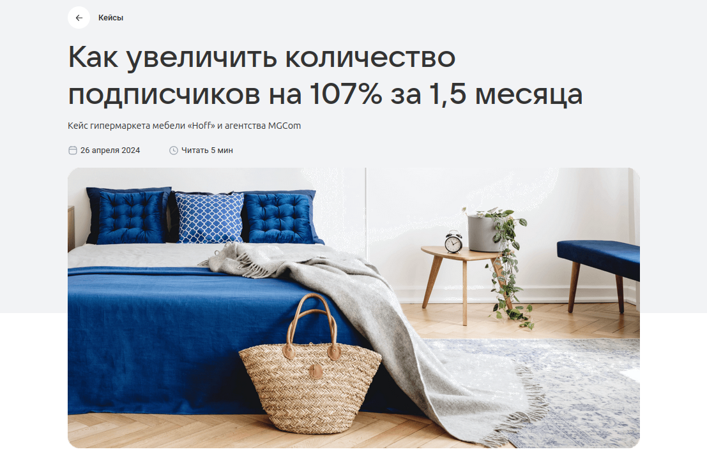
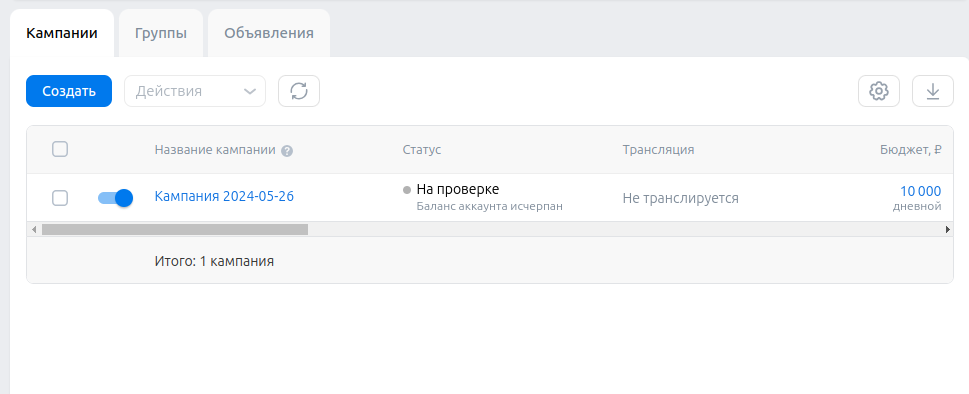

# Домашнее задание 3 по курсу QA

## Разделы:
1. [Хедер](#хедер)
2. [Футер](#футер)
3. [Главная страница](#главная-страница)
4. [Новости](#новости)
5. [Мероприятия](#мероприятия)
6. [Кейсы](#кейсы)
7. [Форум идей](#форум-идей)
8. [Монетизация](#монетизация)
9. [Регистрация кабинета](#регистрация-кабинета)
10. [Кабинет](#кабинет)
11. [Кампании](#кампании)
12. [Аудитории](#аудитории)
13. [Бюджет](#бюджет)
14. [Настройки](#настройки)


## Хедер

> https://ads.vk.com/  
> Без авторизации


- Хедер. При нажатии на логотип "VK Реклама" открывается страница https://ads.vk.com/
- Хедер. При нажатии на кнопку "Новости" открывается страница https://ads.vk.com/news
- Хедер. При наведении на элемент "Обучение" появляется выпадающий список с кнопками
"Полезные материалы", "Мероприятия", "Видеокурсы" и "Сертификация"
- Хедер. При нажатии на кнопку "Кейсы" открывается страница https://ads.vk.com/cases
- Хедер. При нажатии на кнопку "Форум идей" открывается страница https://ads.vk.com/upvote
- Хедер. При нажатии на кнопку "Монетизация" в новой вкладке открывается страница https://ads.vk.com/partner
- Хедер. При нажатии на кнопку "Справка" открывается страница https://ads.vk.com/help
- Хедер. При нажатии на кнопку "Перейти в кабинет" открывается страница https://id.vk.com/auth

### Выпадающий список "Обучение"


- Хедер. Выпадающий список "Обучение". При нажатии на кнопку "Полезные материалы" открывается страница https://ads.vk.com/insights
- Хедер. Выпадающий список "Обучение". При нажатии на кнопку "Мероприятия" открывается страница https://ads.vk.com/events
- Хедер. Выпадающий список "Обучение". При нажатии на кнопку "Видеокурсы" в новой вкладке открывается страница https://expert.vk.com/catalog/courses/
- Хедер. Выпадающий список "Обучение". При нажатии на кнопку "Сертификация" в новой вкладке открывается страница https://expert.vk.com/certification/


## Футер

> https://ads.vk.com/  
> Без авторизации


- Футер. При нажатии на кнопку "Перейти в кабинет" открывается страница https://id.vk.com/auth

### Разделы

- Футер. Разделы. При нажатии на кнопку "Новости" открывается страница https://ads.vk.com/news
- Футер. Разделы. При нажатии на кнопку "Полезные материалы" открывается страница https://ads.vk.com/insights
- Футер. Разделы. При нажатии на кнопку "Мероприятия" открывается страница https://ads.vk.com/events
- Футер. Разделы. При нажатии на кнопку "Документы" открывается страница https://ads.vk.com/documents
- Футер. Разделы. При нажатии на кнопку "Обучение для бизнеса" в новой вкладке открывается страница https://expert.vk.com/
- Футер. Разделы. При нажатии на кнопку "Кейсы" открывается страница https://ads.vk.com/cases
- Футер. Разделы. При нажатии на кнопку "Помощь" открывается страница https://ads.vk.com/help
- Футер. Разделы. При нажатии на кнопку "Монетизация" в новой вкладке открывается страница https://ads.vk.com/partner

### Нижняя панель

- Футер. Нижняя панель. При нажатии на логотип "VK бизнес" в новой вкладке открывается страница https://vk.company/ru/company/business/
- Футер. Нижняя панель. При нажатии на логотипы ВК, Одноклассники и Телеграм в новой вкладке открываются соответствующие сайты
- Футер. Нижняя панель. При нажатии на кнопку "О компании" в новой вкладке открывается страница https://vk.company/ru/
- Футер. Нижняя панель. При нажатии на текущий язык появляется выпадающее меню с кнопками "English" и "Русский"


#### Выпадающее меню

- Футер. Нижняя панель. Выпадающее меню. При нажатии на кнопку "English" текущий язык меняется на английский
- Футер. Нижняя панель. Выпадающее меню. При нажатии на кнопку "Русский" текущий язык меняется на русский


## Главная страница

> https://ads.vk.com/  
> Без авторизации

### Карусель


- Главная страница. Карусель. Происходит автоматическая смена слайдов
- Главная страница. Карусель. При нажатии на элемент управления слайдами происходит смена текущего слайда
- Главная страница. Карусель. При нажатии на кнопку "Получить бонус" открывается страница https://ads.vk.com/promo/firstbonus
- Главная страница. Карусель. При нажатии на кнопку "Зарегистрироваться" открывается https://id.vk.com/auth

### Кейсы компаний


- Главная страница. Кейсы компаний. При нажатии на ссылку "Смотреть все" открывается страница https://ads.vk.com/cases
- Главная страница. Кейсы компаний. При нажатии на блок кейса открывается страница этого кейса



### Вебинары


- Главная страница. Вебинары. При нажатии на блок "Обучающие вебинары" открывается страница https://ads.vk.com/events
- Главная страница. Вебинары. При нажатии на кнопку "Подробнее" открывается страница https://ads.vk.com/events


## Новости

> https://ads.vk.com/news  
> Без авторизации


- Новости. На странице отображается заголовок "Новости"
- Новости. При нажатии на блок новости открывается страница с этой новостью
- Новости. При нажатии на кнопку "Подробнее", находящуюся рядом с главной новостью, открывается страница с этой новостью


## Мероприятия

> https://ads.vk.com/events  
> Без авторизации


- Мероприятия. На странице отображается заголовок "Мероприятия"
- Мероприятия. При нажатии на блок мероприятия открывается страница этого мероприятия
- Мероприятия. При нажатии на кнопку "Подробнее" на блоке мероприятия открывается страница этого мероприятия


## Кейсы

> https://ads.vk.com/cases  
> Без авторизации


- Кейсы. На странице отображается заголовок "Кейсы"
- Кейсы. При нажатии на блок кейса открывается страница этого кейса
- Кейсы. При нажатии на кнопку "Подробнее", находящуюся рядом с главным кейсом, открывается страница этого кейса


## Форум идей

> https://ads.vk.com/upvote  
> Без авторизации


- Форум идей. При нажатии на заголовок идеи открывается страница этой идеи https://ads.vk.com/upvote/{int:id}
- Форум идей. При нажатии на кнопку "Предложить идею" появляется всплывающее окно с условиями участия в форуме идей


### Комментарии 

- Форум идей. Комментарии. При нажатии на значок комментария появляются комментарии
- Форум идей. Комментарии. Количество комментариев в списке совпадает с числом на значке комментария


### Поиск

- Форум идей. Поиск. Работает поиск по заголовкам идей


- Форум идей. Поиск. Работает поиск по идентификаторам идей


### Фильтры

- Форум идей. Фильтры. При нажатии на кнопку выбора темы появляется выпадающее меню со следующими темами:
"Лидформы", "Сообщества", "Форум идей", "Сайты", "Каталог товаров", "Мобильные приложения", "Другое"
- Форум идей. Фильтры. При выборе темы из выпадающего меню отображаются идеи по этой теме


- Форум идей. Фильтры. При нажатии на кнопку выбора статуса появляется выпадающее меню со следующими статусами:
"Голосование", "Уже в работе", "Реализована", "Отклонено"
- Форум идей. Фильтры. При выборе статуса из выпадающего меню отображаются идеи с этим статусом


## Монетизация

> https://ads.vk.com/partner  
> Без авторизации

### Верхний блок


- Монетизация. Верхний блок. При нажатии на кнопку "Перейти в кабинет" в новой вкладке открывается страница https://id.vk.com/auth
- Монетизация. Верхний блок. При нажатии на кнопку "Справка" в новой вкладке открывается страница https://ads.vk.com/help

### Форматы

- Монетизация. Форматы. При нажатии на кнопку "Для приложений" отображаются следующие форматы рекламного блока:
"Баннер", "Нативный формат", "Полноэкранный блок", "Видео за вознаграждение"


- Монетизация. Форматы. При нажатии на кнопку "Для сайтов" отображаются следующие форматы рекламного блока:
  "Баннер", "Instream", "Адаптивный блок", "InPage", "Полноэкранный блок", "Sticky-баннер"


### Форма обратной связи


- Монетизация. Форма обратной связи. Кнопка "Отправить" неактивна при незаполненных полях "Имя" и "Email"
- Монетизация. Форма обратной связи. Кнопка "Отправить" становится активной после заполнения полей "Имя" и "Email"
- Монетизация. Форма обратной связи. При заполнении полей "Имя" и "Email" и нажатии кнопки "Отправить"
появляется сообщение "Спасибо, ваша заявка принята"


## Регистрация кабинета

> https://ads.vk.com/hq/registration  
> Нужна авторизация


- Регистрация кабинета. При нажатии на кнопку "Создать новый кабинет" открывается страница
https://ads.vk.com/hq/registration/new


- Регистрация кабинета. При нажатии на кнопку "English" выбирается английский язык
- Регистрация кабинета. При нажатии на кнопку "Русский" выбирается русский язык
- Регистрация кабинета. При выборе страны Россия в поле "Валюта" доступен "Российский рубль (RUB)"
- Регистрация кабинета. При выборе любой страны кроме России в выпадающем меню поля "Валюта" доступны "Доллар США (USD)" и "Евро (EUR)"
- Регистрация кабинета. Ошибка "Обязательное поле" при незаполненном поле Email
- Регистрация кабинета. Ошибка "Некорректный email адрес" при вводе email`а, не соответствующего формату
```имя почтового ящика + @ + почтовый домен```
- Регистрация кабинета. Ошибка "Минимальная длина 12" при вводе ИНН меньше 12 символов
- Регистрация кабинета. Ошибка "Максимальная длина 12 символов" при вводе ИНН больше 12 символов
- Регистрация кабинета. Ошибка "Обязательное поле" при отсутствии галочки на чекбоксе "Создавая кабинет, вы принимаете условия"
- Регистрация кабинета. При выборе типа аккаунта "Агентство" исчезает тип аккаунта "Физическое лицо"


- Регистрация кабинета. При выборе типа аккаунта "Юридическое лицо" скрываются поля ИНН и ФИО


- Регистрация кабинета. При корректном заполнении формы регистрации кабинета и нажатии на кнопку "Создать кабинет"
регистрация успешно завершается и открывается страница https://ads.vk.com/hq/dashboard


## Кабинет

> https://ads.vk.com/hq/overview  
> Нужна авторизация и зарегистрированный кабинет


### Левая панель

- Кабинет. Левая панель. При нажатии на кнопку "Кампании" открывается страница https://ads.vk.com/hq/dashboard/ad_plans
- Кабинет. Левая панель. При нажатии на кнопку "Аудитории" открывается страница https://ads.vk.com/hq/audience
- Кабинет. Левая панель. При нажатии на кнопку "Бюджет" открывается страница https://ads.vk.com/hq/budget/transactions
- Кабинет. Левая панель. При нажатии на кнопку "Центр коммерции" открывается страница https://ads.vk.com/hq/ecomm/catalogs
- Кабинет. Левая панель. При нажатии на кнопку "Лид-формы" открывается страница https://ads.vk.com/hq/leadads/leadforms
- Кабинет. Левая панель. При нажатии на кнопку "Настройки" открывается страница https://ads.vk.com/hq/settings
- Кабинет. Левая панель. При нажатии на кнопку "Помощь" появляется выпадающее меню с кнопками "Кейсы компаний", "Справка",
"Форум идей", "Задать вопрос"


#### Помощь

- Кабинет. Левая панель. Помощь. При нажатии на кнопку "Кейсы компаний" в новой вкладке открывается страница [Кейсы](#кейсы)
- Кабинет. Левая панель. Помощь. При нажатии на кнопку "Справка" в новой вкладке открывается страница [Справка](#справка)
- Кабинет. Левая панель. Помощь. При нажатии на кнопку "Форум идей" в новой вкладке открывается страница [Форум идей](#форум-идей)
- Кабинет. Левая панель. Помощь. При нажатии на кнопку "Задать вопрос" открывается виджет ВКонтакте


### Верхняя панель

- Кабинет. Верхняя панель. При нажатии на значок кошелька появляется всплывающее окно для пополнения счета


- Кабинет. Верхняя панель. При нажатии на значок колокольчика появляется всплывающее окно "Уведомления"


- Кабинет. Верхняя панель. При нажатии на значок пользователя появляется всплывающее окно с кнопкой "Выйти"


- Кабинет. Верхняя панель. При нажатии на кнопку "Выйти" происходит выход из кабинета
и открывается [Главная страница](#главная-страница)

## Кампании

> https://ads.vk.com/hq/dashboard/ad_plans  
> Нужна авторизация и зарегистрированный кабинет



- Кампании. При нажатии на кнопку "Создать кампанию" открывается страница https://ads.vk.com/hq/new_create/ad_plan


- Кампании. При нажатии на элемент "Сайт" появляется поле "Рекламируемый сайт" для ввода ссылки
- Кампании. Ошибка "Обязательное поле" при незаполненном поле "Рекламируемый сайт"
- Кампании. При заполнении поля "Рекламируемый сайт" появляются поля "Целевое действие", "Стратегия ставок",
  "Бюджет" и "Даты проведения" 


- Кампании. В поле "Даты проведения" по умолчанию отображается текущая дата
- Кампании. Ошибка "Обязательное поле" при незаполненном поле "Бюджет"
- Кампании. Ошибка "Бюджет кампании должен быть не меньше 100₽" при вводе в поле "Бюджет"
значения меньше 100
- Кампании. При корректном заполнении поля "Бюджет" и нажатии на кнопку "Продолжить"
открывается второй этап "Группы объявлений"


- Кампании. При выборе региона показа и нажатии на кнопку "Продолжить" открывается третий этап
"Объявления"


- Кампании. При нажатии на кнопку "Выбрать логотип" открывается панель "Медиатека"


## Аудитории

> https://ads.vk.com/hq/audience  
> Нужна авторизация и зарегистрированный кабинет


- Аудитории. При нажатии на кнопку "Создать аудиторию" появляется панель "Создание аудитории"


- Аудитории. Ошибка "Максимальная длина 255 символов" при вводе в поле "Название" строки более 255 символов
- Аудитории. При вводе в поле "Название" пустой строки название задается автоматически
  в формате ```Аудитория yyyy-mm-dd```, где yyyy-mm-dd - текущая дата
- Аудитории. В счетчике символов корректно отображается длина названия аудитории в символах
- Аудитории. При нажатии на кнопку "Добавить источник" появляется панель "Включить источник"


## Бюджет

> https://ads.vk.com/hq/budget/transactions  
> Нужна авторизация и зарегистрированный кабинет


- Бюджет. При нажатии на кнопку "Пополнить счёт" появляется модальное окно для пополнения счета


- Бюджет. При нажатии на крестик модальное окно для пополнения счета исчезает
- Бюджет. Ошибка "Минимальная сумма 600,00 ₽" при вводе в поле "Сумма к оплате" числа меньше 600
- Бюджет. Ошибка "Минимальная сумма 600,00 ₽" при вводе в поле "Сумма, поступающая на ваш счёт" числа меньше 500
- Бюджет. Ошибка "Уменьшите сумму" при вводе в поле "Сумма к оплате" числа больше 200 000
- Бюджет. Ошибка "Уменьшите сумму" при вводе в поле "Сумма, поступающая на ваш счёт" числа больше 166 666
- Бюджет. В поле "Сумма к оплате" невозможно ввести символы, не являющиеся цифрами
- Бюджет. В поле "Сумма, поступающая на ваш счёт" невозможно ввести символы, не являющиеся цифрами
- Бюджет. При вводе числа ```N``` в поле "Сумма к оплате" автоматически рассчитывается значение поля
"Сумма, поступающая на ваш счёт" по формуле ```N / 1.2```
- Бюджет. При вводе числа ```N``` в поле "Сумма, поступающая на ваш счёт" автоматически рассчитывается значение поля
"Сумма к оплате" по формуле ```N * 1.2```
- Бюджет. При вводе допустимой суммы и нажатии на кнопку "Пополнить счет" появляется iframe VK Pay для оплаты


## Настройки

> Нужна авторизация и зарегистрированный кабинет  
> https://ads.vk.com/hq/settings


- Настройки. При внесении изменений появляются кнопки "Сохранить" и "Отменить"
- Настройки. Ошибка "Некорректный номер телефона" при вводе номера, не соответствующего формату ```префикс "+" и 11 цифр```
- Настройки. При нажатии на кнопку "Добавить email" появляется дополнительное поле для ввода email'а
- Настройки. Ошибка "Некорректный email адрес" при вводе email`а, не соответствующего формату
  ```имя почтового ящика + @ + почтовый домен```
- Настройки. Ошибка "Обязательное поле" при незаполненном поле для ввода email'а
- Настройки. Ошибка "Обязательное поле" при незаполненном поле "ФИО"
- Настройки. Ошибка "Обязательное поле" при незаполненном поле "ИНН"
- Настройки. Ошибка "Длина ИНН должна быть 12 символов" при вводе ИНН меньше 12 символов
- Настройки. Ошибка "Некорректный ИНН" при вводе в поле "ИНН" любого символа кроме цифры
- Настройки. При нажатии на кнопку "Выйти из других устройств" появляется уведомление
"Активные сеансы на других устройствах успешно завершены."
- Настройки. При нажатии на кнопку "Удалить кабинет" появляется всплывающее окно для подтверждения удаления


- Настройки. При нажатии на кнопку "Отменить" все изменения сбрасываются
