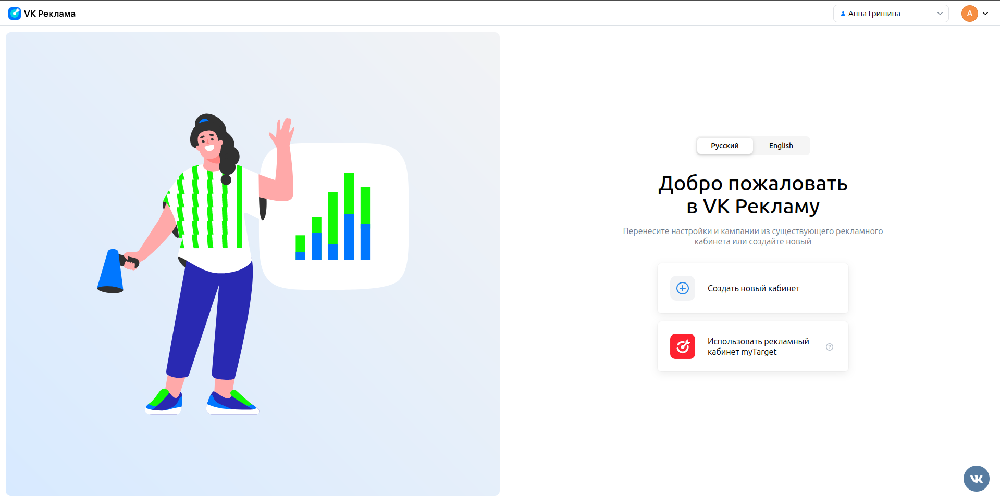

# Домашнее задание 3 по курсу QA

## Разделы:
1. [Главная страница](#главная-страница)
2. [Хедер](#хедер)
3. [Регистрация кабинета](#регистрация-кабинета)

## Главная страница

> https://ads.vk.com/  
> Без авторизации

- Главная страница. Карусель. Происходит автоматическая смена слайдов
- Главная страница. Карусель. При нажатии на элемент управления слайдами происходит смена текущего слайда
- Главная страница. Карусель. При нажатии на кнопку "Получить бонус" открывается [страница с акцией](https://ads.vk.com/promo/firstbonus)
- Главная страница. Карусель. При нажатии на кнопку "Зарегистрироваться" открывается [страница регистрации](https://ads.vk.com/hq/registration)

---

- Главная страница. Кейсы компаний. При нажатии на ссылку "Смотреть все" открывается [страница кейсов](https://ads.vk.com/cases)
- Главная страница. Кейсы компаний. При нажатии на блок кейса открывается страница этого кейса

---

- Главная страница. Вебинары. При нажатии на блок "Обучающие вебинары" открывается [страница мероприятий](https://ads.vk.com/events)
- Главная страница. Вебинары. При нажатии на кнопку "Подробнее" открывается [страница мероприятий](https://ads.vk.com/events)

## Хедер

> https://ads.vk.com  
> Без авторизации

- Хедер. При нажатии на логотип "VK Реклама" открывается страница https://ads.vk.com
- Хедер. При нажатии на кнопку "Новости" открывается страница https://ads.vk.com/news
- Хедер. При наведении на элемент "Обучение" появляется выпадающий список

- Хедер. Выпадающий список "Обучение". При нажатии на кнопку "Полезные материалы" открывается страница https://ads.vk.com/insights
- Хедер. Выпадающий список "Обучение". При нажатии на кнопку "Мероприятия" открывается страница https://ads.vk.com/events
- Хедер. Выпадающий список "Обучение". При нажатии на кнопку "Видеокурсы" в новой вкладке открывается страница https://expert.vk.com/catalog/courses/
- Хедер. Выпадающий список "Обучение". При нажатии на кнопку "Сертификация" в новой вкладке открывается страница https://expert.vk.com/certification/

---

- Хедер. При нажатии на кнопку "Кейсы" открывается страница https://ads.vk.com/cases
- Хедер. При нажатии на кнопку "Форум идей" открывается страница https://ads.vk.com/upvote
- Хедер. При нажатии на кнопку "Монетизация" в новой вкладке открывается страница https://ads.vk.com/partner
- Хедер. При нажатии на кнопку "Справка" открывается страница https://ads.vk.com/help
- Хедер. При нажатии на кнопку "Перейти в кабинет" открывается страница авторизации

## Регистрация кабинета

> https://ads.vk.com/hq/registration  
> Нужна авторизация

- Регистрация. При нажатии на кнопку "Создать новый кабинет" открывается [страница регистрации нового кабинета](https://ads.vk.com/hq/registration/new) 

- Регистрация кабинета. При нажатии на кнопку English текст меняется на английский
- Регистрация кабинета. При выборе типа аккаунта "Агентство" исчезает кнопка "Физическое лицо"
- Регистрация кабинета. При выборе страны Россия доступна валюта "Российский рубль (RUB)"
- Регистрация кабинета. При выборе любой страны кроме России в выпадающем меню доступны валюты "Доллар США (USD)" и "Евро (EUR)"
- Регистрация кабинета. Ошибка "Обязательное поле" при незаполненном поле Email
- Регистрация кабинета. Ошибка "Некорректный email адрес" при вводе email`а, не соответствующего схеме "имя почтового ящика + @ + почтовый домен"
- Регистрация кабинета. Ошибка "Обязательное поле" при отсутствии галочки на чекбоксе "Создавая кабинет, вы принимаете условия"

## Авторизация

- Авторизация. При нажатии на кнопку "Войти в другой аккаунт" появляется поле для ввода логина

- Авторизация. Ошибка при вводе несуществующего логина

