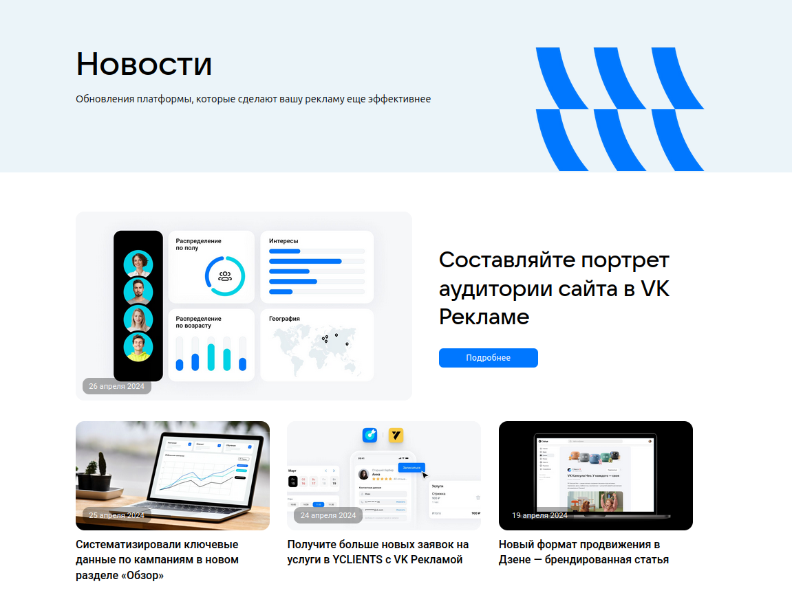

# Домашнее задание 3 по курсу QA

## Разделы:
1. [Хедер](#хедер)
2. [Футер](#футер)
3. [Главная страница](#главная-страница)
4. [Новости](#новости)
5. [Страница новости](#страница-новости)
6. [Полезные материалы](#полезные-материалы)
7. [Страница полезного материала](#страница-полезного-материала)
8. [Мероприятия](#мероприятия)
9. [Страница мероприятия](#страница-мероприятия)
10. [Кейсы](#кейсы)
11. [Страница кейса](#страница-кейса)
12. [Форум идей](#форум-идей)
13. [Монетизация](#монетизация)
14. [Справка](#справка)
15. [Страница авторизации](#страница-авторизации)
16. [Регистрация кабинета](#регистрация-кабинета)
17. [Кабинет](#кабинет)
18. [Кампании](#кампании)
19. [Аудитории](#аудитории)
20. [Бюджет](#бюджет)
21. [Центр коммерции](#центр-коммерции)
22. [Лид-формы](#лид-формы)
23. [Настройки](#настройки)


## Хедер

> https://ads.vk.com/  
> Без авторизации


- Хедер. При нажатии на логотип "VK Реклама" открывается [Главная страница](#главная-страница)
- Хедер. При нажатии на кнопку "Новости" открывается страница [Новости](#новости)
- Хедер. При наведении на элемент "Обучение" появляется выпадающий список с кнопками
"Полезные материалы", "Мероприятия", "Видеокурсы" и "Сертификация"
- Хедер. При нажатии на кнопку "Кейсы" открывается страница [Кейсы](#кейсы)
- Хедер. При нажатии на кнопку "Форум идей" открывается страница [Форум идей](#форум-идей)
- Хедер. При нажатии на кнопку "Монетизация" в новой вкладке открывается страница [Монетизация](#монетизация)
- Хедер. При нажатии на кнопку "Справка" открывается страница [Справка](#справка)
- Хедер. При нажатии на кнопку "Перейти в кабинет" открывается [страница авторизации](#страница-авторизации)

### Выпадающий список "Обучение"


- Хедер. Выпадающий список "Обучение". При нажатии на кнопку "Полезные материалы" открывается страница [Полезные материалы](#полезные-материалы)
- Хедер. Выпадающий список "Обучение". При нажатии на кнопку "Мероприятия" открывается страница [Мероприятия](#мероприятия)
- Хедер. Выпадающий список "Обучение". При нажатии на кнопку "Видеокурсы" в новой вкладке открывается страница https://expert.vk.com/catalog/courses/
- Хедер. Выпадающий список "Обучение". При нажатии на кнопку "Сертификация" в новой вкладке открывается страница https://expert.vk.com/certification/


## Футер

> https://ads.vk.com/  
> Без авторизации


- Футер. При нажатии на кнопку "Перейти в кабинет" открывается [страница авторизации](#страница-авторизации)

### Разделы

- Футер. Разделы. При нажатии на кнопку "Новости" открывается страница [Новости](#новости)
- Футер. Разделы. При нажатии на кнопку "Полезные материалы" открывается страница [Полезные материалы](#полезные-материалы)
- Футер. Разделы. При нажатии на кнопку "Мероприятия" открывается страница [Мероприятия](#мероприятия)
- Футер. Разделы. При нажатии на кнопку "Документы" открывается страница https://ads.vk.com/documents
- Футер. Разделы. При нажатии на кнопку "Обучение для бизнеса" в новой вкладке открывается страница https://expert.vk.com/
- Футер. Разделы. При нажатии на кнопку "Кейсы" открывается страница [Кейсы](#кейсы)
- Футер. Разделы. При нажатии на кнопку "Помощь" открывается страница [Справка](#справка)
- Футер. Разделы. При нажатии на кнопку "Монетизация" в новой вкладке открывается страница [Монетизация](#монетизация)

### Нижняя панель

- Футер. Нижняя панель. При нажатии на логотип "VK бизнес" в новой вкладке открывается страница https://vk.company/ru/company/business/
- Футер. Нижняя панель. При нажатии на логотипы ВК, Одноклассники и Телеграм в новой вкладке открываются соответствующие сайты
- Футер. Нижняя панель. При нажатии на кнопку "О компании" в новой вкладке открывается страница https://vk.company/ru/
- Футер. Нижняя панель. При нажатии на иконку текущего языка появляется выпадающее меню


#### Выпадающее меню

- Футер. Нижняя панель. Выпадающее меню. При нажатии на кнопку "English" язык страницы меняется на английский
- Футер. Нижняя панель. Выпадающее меню. При нажатии на кнопку "Русский" язык страницы меняется на русский


## Главная страница

> https://ads.vk.com/  
> Без авторизации

### Карусель


- Главная страница. Карусель. Происходит автоматическая смена слайдов
- Главная страница. Карусель. При нажатии на элемент управления слайдами происходит смена текущего слайда
- Главная страница. Карусель. При нажатии на кнопку "Получить бонус" открывается страница https://ads.vk.com/promo/firstbonus
- Главная страница. Карусель. При нажатии на кнопку "Зарегистрироваться" открывается [страница авторизации](#страница-авторизации)

### Кейсы компаний


- Главная страница. Кейсы компаний. При нажатии на ссылку "Смотреть все" открывается страница [Кейсы](#кейсы)
- Главная страница. Кейсы компаний. При нажатии на блок кейса открывается [страница этого кейса](#страница-кейса)

### Вебинары


- Главная страница. Вебинары. При нажатии на блок "Обучающие вебинары" открывается страница [Мероприятия](#мероприятия)
- Главная страница. Вебинары. При нажатии на кнопку "Подробнее" открывается страница [Мероприятия](#мероприятия)


## Новости

> https://ads.vk.com/news  
> Без авторизации



- Новости. При нажатии на кнопку "Подробнее" открывается [страница новости](#страница-новости)


- Новости. При нажатии на блок новости открывается [страница этой новости](#страница-новости)

## Страница новости

> https://ads.vk.com/news/{str:title}  
> Без авторизации


- Страница новости. При нажатии стрелку "Новости" открывается страница [Новости](#новости)
- Страница новости. При нажатии на кнопку с текстом "В кабинет" или "Запустить рекламу" внизу страницы
в новой вкладке открывается [страница авторизации](#страница-авторизации)

## Полезные материалы

> https://ads.vk.com/insights  
> Без авторизации


- Полезные материалы. При нажатии на кнопку "Подробнее" открывается [страница материала](#страница-полезного-материала)


- Полезные материалы. При нажатии на блок материала открывается [страница этого материала](#страница-полезного-материала)

## Страница полезного материала

> https://ads.vk.com/insights/{str:title}  
> Без авторизации

## Мероприятия

> https://ads.vk.com/events 
> Без авторизации

## Страница мероприятия

> https://ads.vk.com/events/{str:title} 
> Без авторизации

## Кейсы

> https://ads.vk.com/cases  
> Без авторизации


- Кейсы. При нажатии на кнопку "Подробнее" открывается [страница кейса](#страница-кейса)


- Кейсы. При нажатии на блок кейса открывается [страница этого кейса](#страница-кейса)

## Страница кейса

> https://ads.vk.com/cases/{str:title}  
> Без авторизации


- Страница кейса. На странице есть разделы "Цели кампании", "Механика", "Результаты"
- Страница кейса. При нажатии стрелку "Кейсы" открывается страница [Кейсы](#кейсы)
- Страница кейса. При нажатии на кнопку с текстом "В кабинет" или "Запустить рекламу" внизу страницы
в новой вкладке открывается [страница авторизации](#страница-авторизации)

## Форум идей

> https://ads.vk.com/upvote  
> Без авторизации


- Форум идей. При нажатии на заголовок идеи открывается страница этой идеи https://ads.vk.com/upvote/{int:id}
- Форум идей. При нажатии на кнопку "Предложить идею" появляется всплывающее окно с условиями участия в форуме идей


### Комментарии 

- Форум идей. Комментарии. При нажатии на значок комментария появляется список комментариев к идее
- Форум идей. Комментарии. Количество комментариев в списке совпадает с числом на значке комментария


### Поиск

- Форум идей. Поиск. Работает поиск по заголовкам идей


- Форум идей. Поиск. Работает поиск по идентификаторам идей


### Фильтры

- Форум идей. Фильтры. При нажатии на кнопку выбора темы появляется выпадающее меню со следующими темами:
"Лидформы", "Сообщества", "Форум идей", "Сайты", "Каталог товаров", "Мобильные приложения", "Другое"
- Форум идей. Фильтры. При выборе темы из выпадающего меню отображаются идеи по этой теме


- Форум идей. Фильтры. При нажатии на кнопку выбора статуса появляется выпадающее меню со следующими статусами:
"Голосование", "Уже в работе", "Реализована", "Отклонено"
- Форум идей. Фильтры. При выборе статуса из выпадающего меню отображаются идеи с этим статусом


## Монетизация

> https://ads.vk.com/partner  
> Без авторизации

### Верхний блок


- Монетизация. Верхний блок. При нажатии на кнопку "Перейти в кабинет" в новой вкладке открывается
[страница авторизации](#страница-авторизации)
- Монетизация. Верхний блок. При нажатии на кнопку "Справка" в новой вкладке открывается страница [Справка](#справка)

### Форматы

- Монетизация. Форматы. При нажатии на кнопку "Для приложений" отображаются следующие форматы рекламного блока:
"Баннер", "Нативный формат", "Полноэкранный блок", "Видео за вознаграждение"


- Монетизация. Форматы. При нажатии на кнопку "Для сайтов" отображаются следующие форматы рекламного блока:
  "Баннер", "Instream", "Адаптивный блок", "InPage", "Полноэкранный блок", "Sticky-баннер"


### Форма обратной связи


- Монетизация. Форма обратной связи. Кнопка "Отправить" неактивна при незаполненных полях "Имя" и "Email"
- Монетизация. Форма обратной связи. При заполнении обязательных полей и нажатии кнопки "Отправить"
вместо формы на несколько секунд появляется сообщение "Спасибо, ваша заявка принята"


## Справка

> https://ads.vk.com/help  
> Без авторизации

## Страница авторизации

> На странице https://ads.vk.com/ необходимо нажать на кнопку "Перейти в кабинет",
> после этого откроется страница авторизации.  
> 
> Тестовый аккаунт  
> email: kayetana_qa@mail.ru


- Авторизация. Ошибка при вводе несуществующего логина


## Регистрация кабинета

> https://ads.vk.com/hq/registration  
> Нужна авторизация


- Регистрация кабинета. При нажатии на кнопку "Создать новый кабинет" открывается страница
https://ads.vk.com/hq/registration/new


- Регистрация кабинета. При нажатии на кнопку English текст меняется на английский
- Регистрация кабинета. При выборе страны Россия в поле "Валюта" доступен "Российский рубль (RUB)"
- Регистрация кабинета. При выборе любой страны кроме России в выпадающем меню поля "Валюта" доступны "Доллар США (USD)" и "Евро (EUR)"
- Регистрация кабинета. Ошибка "Обязательное поле" при незаполненном поле Email
- Регистрация кабинета. Ошибка "Некорректный email адрес" при вводе email`а, не соответствующего формату
```имя почтового ящика + @ + почтовый домен```
- Регистрация кабинета. Ошибка при вводе ИНН меньше 12 символов
- Регистрация кабинета. Ошибка при вводе ИНН больше 12 символов
- Регистрация кабинета. Ошибка "Обязательное поле" при отсутствии галочки на чекбоксе "Создавая кабинет, вы принимаете условия"
- Регистрация кабинета. При выборе типа аккаунта "Агентство" исчезает кнопка "Физическое лицо"


- Регистрация кабинета. При выборе типа аккаунта "Юридическое лицо" скрываются поля ИНН и ФИО


- Регистрация кабинета. При корректном заполнении формы регистрации кабинета и нажатии на кнопку "Создать кабинет"
регистрация успешно завершается и открывается страница https://ads.vk.com/hq/dashboard


## Кабинет

> https://ads.vk.com/hq/overview  
> Нужна авторизация и зарегистрированный кабинет


### Левая панель

- Кабинет. Левая панель. Отображены разделы "Обзор", "Кампании", "Аудитории", "Бюджет", "Обучение",
"Центр коммерции", "Сайты", "Мобильные приложения", "Лид-формы", "Настройки", "Помощь"
- Кабинет. Левая панель. При нажатии на кнопку "Помощь" появляется выпадающее меню с кнопками "Кейсы компаний", "Справка",
"Форум идей", "Задать вопрос"


#### Помощь

- Кабинет. Левая панель. Помощь. При нажатии на кнопку "Кейсы компаний" в новой вкладке открывается страница [Кейсы](#кейсы)
- Кабинет. Левая панель. Помощь. При нажатии на кнопку "Справка" в новой вкладке открывается страница [Справка](#справка)
- Кабинет. Левая панель. Помощь. При нажатии на кнопку "Форум идей" в новой вкладке открывается страница [Форум идей](#форум-идей)
- Кабинет. Левая панель. Помощь. При нажатии на кнопку "Задать вопрос" открывается виджет ВКонтакте


### Верхняя панель

- Кабинет. Верхняя панель. При нажатии на значок кошелька появляется всплывающее окно для пополнения счета


- Кабинет. Верхняя панель. При нажатии на значок колокольчика появляется всплывающее окно "Уведомления"


- Кабинет. Верхняя панель. При нажатии на значок пользователя появляется всплывающее окно с кнопкой "Выйти"


- Кабинет. Верхняя панель. При нажатии на кнопку "Выйти" происходит выход из кабинета
и открывается [Главная страница](#главная-страница)

## Кампании

## Аудитории

> https://ads.vk.com/hq/audience  
> Нужна авторизация и зарегистрированный кабинет


- Аудитории. При нажатии на кнопку "Создать аудиторию" появляется всплывающее окно "Создание аудитории"


- Аудитории. Ошибка "Максимальная длина 255 символов" при вводе в поле "Название" строки более 255 символов
- Аудитории. При вводе в поле "Название" пустой строки название задается автоматически
  в формате ```Аудитория yyyy-mm-dd```, где yyyy-mm-dd - текущая дата
- Аудитории. В счетчике символов корректно отображается длина названия аудитории в символах
- Аудитории. При нажатии на кнопку "Добавить источник" появляется всплывающее окно "Включить источник"


## Бюджет

> https://ads.vk.com/hq/budget/transactions  
> Нужна авторизация и зарегистрированный кабинет


- Бюджет. При нажатии на кнопку "Пополнить счёт" появляется всплывающее окно для пополнения счета


- Бюджет. При нажатии на крестик всплывающее окно для пополнения счета исчезает
- Бюджет. В поле "Сумма к оплате" невозможно ввести никакие символы кроме цифр
- Бюджет. В поле "Сумма, поступающая на ваш счёт" невозможно ввести никакие символы кроме цифр
- Бюджет. При вводе числа ```N``` в поле "Сумма к оплате" автоматически рассчитывается значение поля
"Сумма, поступающая на ваш счёт" по формуле ```N / 1.2```
- Бюджет. При вводе числа ```N``` в поле "Сумма, поступающая на ваш счёт" автоматически рассчитывается значение поля
"Сумма к оплате" по формуле ```N * 1.2```
- Бюджет. Ошибка "Минимальная сумма 600,00 ₽" при вводе в поле "Сумма к оплате" числа меньше 600
- Бюджет. Ошибка "Минимальная сумма 600,00 ₽" при вводе в поле "Сумма, поступающая на ваш счёт" числа меньше 500
- Бюджет. Ошибка "Уменьшите сумму" при вводе в поле "Сумма к оплате" числа больше 200 000
- Бюджет. Ошибка "Уменьшите сумму" при вводе в поле "Сумма, поступающая на ваш счёт" числа больше 166 666
- Бюджет. При вводе достаточной суммы и нажатии на кнопку "Пополнить счет" появляется всплывающее окно для
выбора способа оплаты


## Центр коммерции

## Лид-формы

## Настройки

> Нужна авторизация и зарегистрированный кабинет

### Общие

> https://ads.vk.com/hq/settings


- Настройки. Общие. При внесении любых изменений появляются кнопки "Сохранить" и "Отменить"
- Настройки. Общие. Ошибка "Некорректный номер телефона" при вводе номера, не соответствующего формату ```префикс "+" и 11 цифр```
- Настройки. Общие. При нажатии на кнопку "Добавить email" появляется поле для ввода email'а
- Настройки. Общие. Ошибка "Обязательное поле" при незаполненном поле для ввода email'а
- Настройки. Общие. Ошибка "Некорректный email адрес" при вводе email`а, не соответствующего формату
  ```имя почтового ящика + @ + почтовый домен```
- Настройки. Общие. При нажатии на крестик рядом с полем для ввода email'а поле исчезает
- Настройки. Общие. Ошибка "Обязательное поле" при незаполненном поле "ФИО"
- Настройки. Общие. Ошибка "Обязательное поле" при незаполненном поле "ИНН"
- Настройки. Общие. Ошибка "Длина ИНН должна быть 12 символов" при вводе ИНН меньше 12 символов
- Настройки. Общие. Ошибка "Некорректный ИНН" при вводе в поле "ИНН" любого символа кроме цифры
- Настройки. Общие. Невозможно ввести больше 12 символов в поле "ИНН"
- Настройки. Общие. При нажатии на кнопку "Язык интерфейса" появляется выпадающее меню с кнопками "RU" и "EN"
- Настройки. Общие. При нажатии на кнопку "Выйти из других устройств" появляется уведомление
"Активные сеансы на других устройствах успешно завершены."
- Настройки. Общие. При нажатии на кнопку "Удалить кабинет" появляется всплывающее окно для подтверждения удаления


- Настройки. Общие. При нажатии на кнопку "Отменить" все изменения сбрасываются
- Настройки. Общие. При корректном заполнении полей и нажатии на кнопку "Сохранить" все изменения сохраняются

### Уведомления

> https://ads.vk.com/hq/settings/notifications


- Настройки. Уведомления. При внесении любых изменений появляются кнопки "Сохранить" и "Отменить"
- Настройки. Уведомления. При нажатии на переключатель рядом с email`ом появляется предупреждение "Уведомления выключены"


- Настройки. Уведомления. При повторном нажатии на переключатель рядом с email`ом предупреждение "Уведомления выключены" исчезает
- Настройки. Уведомления. При нажатии на кнопку "Отменить" все изменения сбрасываются
- Настройки. Уведомления. При нажатии на кнопку "Сохранить" все изменения сохраняются

### Права доступа

> https://ads.vk.com/hq/settings/access


- Настройки. Права доступа. При нажатии на ссылку "Подробнее" в новой вкладке открывается страница
https://ads.vk.com/help/articles/additionalaccounts
- Настройки. Права доступа. При нажатии на кнопку "Добавить кабинет" появляется всплывающее окно для добавления кабинета


